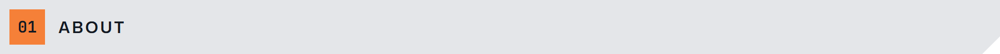
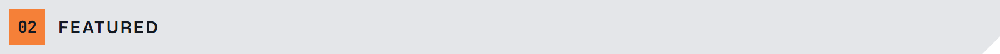
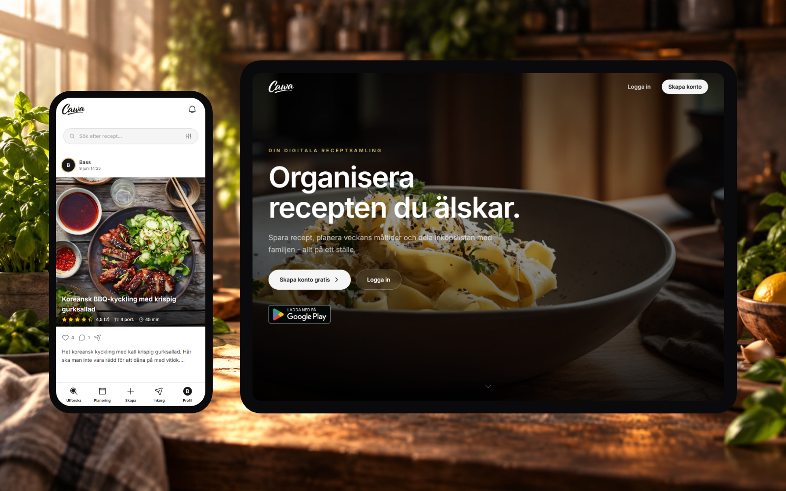
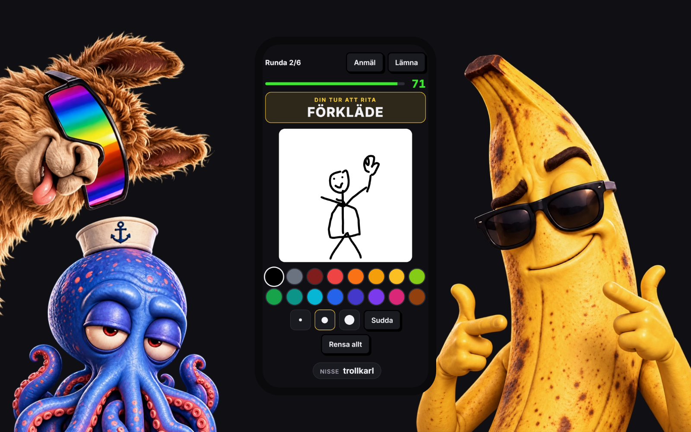

<a name="hero">
<picture>
  <source media="(prefers-color-scheme: dark)" srcset="assets/hero-dark.svg">
  
</picture>
</a>

[calmarwebb.se](https://calmarwebb.se) · [LinkedIn](https://linkedin.com/in/sebastianvaldemarsson) · [Email](mailto:sebastian@calmarwebb.se)

 

<a name="about">
<picture>
  <source media="(prefers-color-scheme: dark)" srcset="assets/head-about-dark.png">
  
</picture>
</a>

- Studying Fullstack Development at **Medieinstitutet**, right now: third-party integrations
- Founder of **Calmar Webb AB**, with two apps live on Google Play
- Product developer in the food industry, on leave while I study
- Off the clock: Home Assistant, cooking, renovating, gaming and family

 

<a name="featured">
<picture>
  <source media="(prefers-color-scheme: dark)" srcset="assets/head-featured-dark.png">
  
</picture>
</a>

#### [Cawa](https://cawa.nu): recipes, meal plans and shopping lists

A social recipe platform for the whole household. Save recipes, plan the week and share with friends. Built and run solo, live on the web and on Google Play.

`React` `TypeScript` `Supabase` `Tailwind CSS` `Capacitor`

[Website](https://cawa.nu) · [Google Play](https://play.google.com/store/apps/details?id=nu.cawa.app)

 

#### [Dorkus](https://dorkus.se): a drawing party game

A drawing game for 2–8 players. No TV, no controllers: the phones are the game. One player has the app, everyone else joins from the browser.

`React` `TypeScript` `Cloudflare Workers` `WebSockets` `Capacitor`

[Website](https://dorkus.se) · [Google Play](https://play.google.com/store/apps/details?id=se.dorkus.app)

 

<a name="more-projects">
<picture>
  <source media="(prefers-color-scheme: dark)" srcset="assets/head-more-dark.png">
  
</picture>
</a>

**[Nocturne](https://murder-mystery-rust.vercel.app)**: multiplayer murder-mystery game, built in a team of three with [Carolina](https://github.com/Carowa27) and [Steven](https://github.com/stevenlomon) · `Next.js` `Supabase`

**[HASP](https://github.com/csschef/hasp)**: a fast, mobile-first dashboard for Home Assistant · `TypeScript` `Web Components`

**[Vikingsås](https://chili-ehandel.vercel.app)**: online shop for chili sauces, a school project · `React` `Express` `PostgreSQL`
